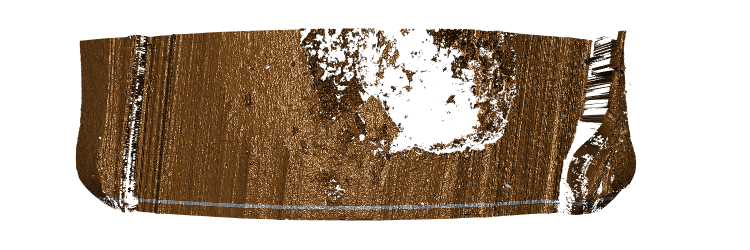
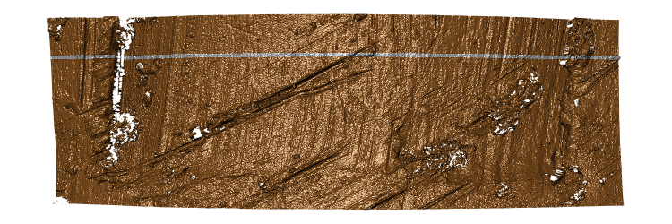
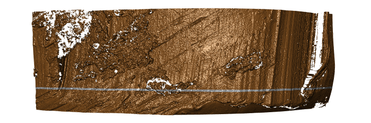
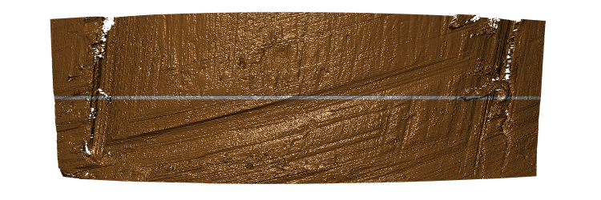
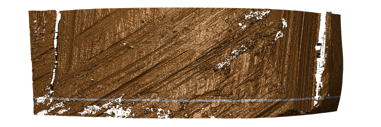
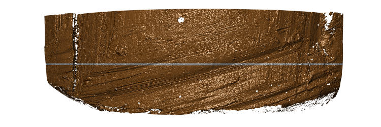

## Land engraved areas exhibiting damage 

### Extreme pitting

Pitting is caused by left-over gun powder exploding in the barrel. This causes holes in the surface of the bullet. Usually these holes are small. The example below is an extreme form of pitting.

Hamby173-Br4-B2-L1 

### Tank rash 

Tank rash is damage to the bullet after it exits the barrel during the firing. 
This kind of damage is often caused by a bulled scraping along the side of the tank used during the bullet collection, hence the name. 
Because the damage happens after the firing, the marks are unrelated to the barrel and should not be used for any comparisons. 
The scans below are excluded from the training data because they are unsuitable for a comparison of striation marks. 

Hamby252-Br6-B2-L1

Hamby252-Br9-B1-L2

Hamby252-BrUkn-BB-L2

Hamby252-BrUkn-BQ-L4

Hamby252-BrUkn-BU-L4

