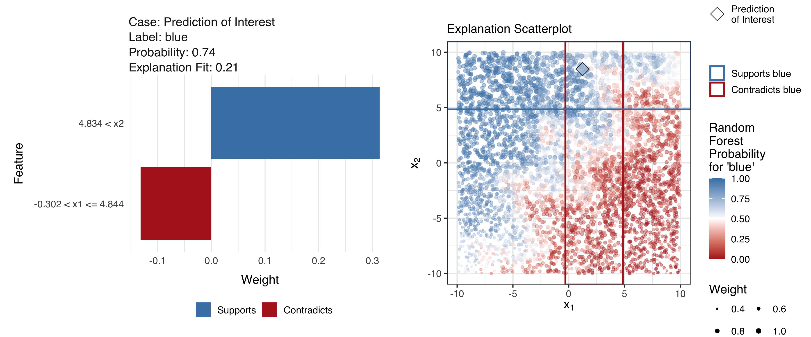

# LIME Diagnostics Manuscript



This repository contains the files associated with the manuscript
“Visual Diagnostics of a Model Explainer – Tools for the Assessment of
LIME Explanations” by Katherine Goode and Heike Hofmann. The rest of
this readme contains:

  - [information about the files in the
    repository](#description-of-items-in-repository),
  - [instructions for knitting the
    manuscript](#instructions-for-compiling-manuscript),
  - [descriptions of the bullet data used in the
    manuscript](#additional-information-on-bullet-data), and
  - [information on the font sizes used for the figures in the
    manuscript](#figure-font-size-information).

## Description of Items in Repository

The contents of the folders and main directory are described below:

[**code**](code)

Contains the R code associated with the manuscript that is not directly
included in [paper.Rnw](paper.Rnw) (such as some external data cleaning
and file organization):

  - [01-raw-file-compression](code/01-raw-file-compression.md) contains
    R code for compressing the static figure used in the manuscript and
    accessing and compressing the raw bullet data to be uploaded to
    GitHub
  - [02-data-preparation](code/02-data-preparation.md) contains R code
    for preparing the raw bullet data (bullet training data, bullet
    testing data, and example matching signatures) to be used in the
    manuscript and saves zip versions of the prepared data sets to be
    uploaded to GitHub
  - [03-submission-steps](code/03-submission-steps.md) contains the to
    do list and R code for preparing the files for submission to the ASA
    Data Science Journal

[**cover-letter**](cover-letter)

Contains the files associated with the cover letter submitted to the ASA
Data Science journal.

[**data**](data/)

Contains the data used to generate the manuscript:

  - [bullet-rf.rds](data/bullet-rf.rds) contains the saved version of
    the random forest trained using the bullet matching training data.
  - [bullet-test.csv.zip](data/bullet-test.csv.zip) and
    [bullet-train.csv.zip](data/bullet-train.csv.zip) contain the data
    used for the bullet examples in the manuscript. See [“Additional
    Information on Bullet Data”](#additional-information-on-bullet-data)
    below for more information about the data.
  - [example-signatures.csv.zip](data/example-signatures.csv.zip)
    contains signature data from two matching bullet lands that is used
    to generate a figure in the manuscript.
  - [raw](data/raw) contains the raw versions of the data files (from
    Heike and CSAFE) that the above datasets are derived from. *Do not
    alter the data in these files*:
      - [CCFs\_withlands.csv.zip](data/raw/CCFs_withlands.csv.zip): raw
        version of the bullet training data
      - [h224-set1-features.rds.zip](data/raw/h224-set1-features.rds.zip)
        and
        [h224-set11-features.rds.zip](data/raw/h224-set11-features.rds.zip):
        raw versions of the bullet testing data
      - [signatures.rds.zip](data/raw/signatures.rds.zip): raw version
        of the example matching signatures data
  - [README.txt](data/README.txt) contains descriptions of the data
    files (and code files) provided with the submission of the paper.
  - [sine-data-test.rds](data/sine-data-test.rds) and
    [sine-data-train.rds](data/sine-data-train.rds) contain saved
    version of the sine data testing and training sets generated by the
    code in the manuscript.
  - [sine-lime-explain.rds](data/sine-lime-explain.rds) contains the
    LIME explanations for the random forest predictions from the sine
    data test set.

[**figure-static**](figure-static/)

Contains the static figures associated with the project:

  - [figure-06-1.png.zip](figure-static/figure-06-1.png.zip) is the one
    figure in the manuscript that is not generated using R code.
  - [figure-readme.png](figure-static/figure-readme.png) is a figure
    used in this readme.

[**LEAscans**](LEAscans/)

Contains information on the land engraved areas (LEAs) excluded from the
Hamby bullets used to create the training data.

[**old-version**](old-version/)

Contains the files associated with an old version of the manuscript that
is much longer than the submitted version.

[**submissions**](submissions/)

Contains folders with the files submitted to the ASA Data Science
Journal. The folders within are named by the date of submission. The
files are moved here using code in the file
[code/03-submission-steps.R](code/03-submission-steps.Rmd). The only
submission files not included on GitHub are the EPS figures due to size
constraints.

[**support-info**](support-info/)

Contains the files associated with the manuscript’s supporting
information document:

  - [figures](support-info/figures) contains the figures generated by
    the supporting information document.
  - [support-info-references.bib](support-info/support-info-references.bib)
    contains the bibtex information for the references in the supporting
    information document.
  - [supporting-information.pdf](support-info/supporting-information.pdf)
    and
    [supporting-information.Rnw](support-info/supporting-information.Rnw)
    are the supporting information document.

**Main Directory**

  - [.gitattributes](.gitattributes) is needed for GitHub large file
    storage.
  - [.gitignore](.gitignore) contains objects to be ignored by git.
  - [paper.Rnw](paper.Rnw), [paper.pdf](paper.pdf), and
    [paper.tex](paper.tex) are the manuscript. Note that paper.pdf and
    paper.tex are generated by paper.Rnw.
  - [README.Rmd](README.Rmd) and [README.md](README.md) are the readme
    files that generated this output.
  - [references.bib](references.bib) contains the bibtex information for
    the references in the manuscript.
  - [WileyNJG-AMS.bst](WileyNJD-AMS.bst) and
    [WileyNJG-v2.cls](WileyNJD-v2.cls) contain the latex formatting
    specifications for the ASA Data Science Journal.

## Instructions for Compiling Manuscript

When the manuscript is compiled, various files will be generated (such
as data-bullet-explain.rds and figure-10-1.png). The first time the
manuscript is compiled, it will take a while (possibly up to several
hours). Once these files have been generated, the manuscript will take
much less time to compile (approximately a few minutes).

Follow these instructions to compile the manuscript:

1.  Pull the repository from GitHub.
2.  Install R packages [goodekat/lime](https://github.com/goodekat/lime)
    and [goodekat/limeaid](https://github.com/goodekat/limeaid) from
    GitHub using the remotes R package. (Note that goodekat/lime is a
    forked versions of
    [thomasp85/lime](https://github.com/thomasp85/lime) with minor
    changes to extract objects for the analysis in the manuscript.)

<!-- end list -->

``` r
remotes::install_github("goodekat/lime")
remotes::install_github("goodekat/limeaid")
```

3.  Compile manuscript (via the [paper.Rnw](paper.Rnw) file).

## Additional Information on Bullet Data

The data used in the manuscript for the bullet comparison examples is
described below. Note that this text is also included in the file
[data/readme.txt](data/readme.txt) that is submitted with the
manuscript.

### bullet-train.csv

The [<b>bullet-train</b>](data/bullet-train.csv.zip) data has 83,028
rows and 13 columns that contain comparison features described in Hare,
Hofmann, and Carriquiry (2017) based on high resolution microscopy scans
of fired bullets from Hamby sets 173 and 252 (Hamby, Brundage, and
Thorpe 2009). This dataset is created from the x3p scans of bullet land
engraved areas available from the [NIST Ballistics Toolmark Research
Database](https://tsapps.nist.gov/NRBTD/). It contains comparisons from
408 bullet-land signatures. 12 of the overall 420 lands (6 lands per
bullets, 35 bullets in each set) are excluded from the comparison. Six
of these lands show so-called “tank rash” - damage to the bullets after
it exited the barrel (see [tank rash scans](LEAscans/tankrash.md)).
Another bullet (Bullet E from Hamby 173) is excluded because it could
not be matched visually to the barrel it was supposedly from (see [scans
from bullet E](LEAscans/bullete.md)).

bullet-train is generated from the raw file of comparison features,
which is found [here](data/raw/CCFs_withlands.csv.zip). The steps taken
to create bullet-train from the raw data are found
[here](code/02-data-preparation.Rmd). These steps involve renaming some
variables, selecting the variables of interest for the manuscript, and
adjusting the land IDs associated with the signatures.

The variables in the data are described below. Further descriptions of
the comparison features are found in Hare, Hofmann, and Carriquiry
(2017).

#### Variables used as key variables:

  - **case**: ID number associated with the bullet-land signature
    comparison.
  - **land\_id1**, **land\_id2**: IDs describing the two land engraved
    areas in the comparison. The format is “study-barrel-bullet-land”.

#### Comparison features:

  - **ccf**: Maximized cross-correlation between two LEA signatures.
  - **rough\_cor**: Correlation after detrending aligned signatures.
  - **D**: Euclidean distance (in millimeters) between two aligned
    signatures.
  - **sd\_D**: Standard deviation of the previous measure along the
    signature.
  - **matches**, **mismatches**: Number of matching/non-matching peaks
    and valleys in the aligned signatures.
  - **cms**: Consecutively matching striae is a measure introduced by
    Biasotti (1959) describing the longest run of matching peaks between
    two aligned signatures.
  - **non\_cms**: The number of consecutively non-matching peaks.
  - **sum\_peaks**: The depth of peaks measured as the sum of matching
    peaks between two aligned signatures (in microns).
  - **samesource**: Ground truth whether a pair is from the same source
    (“TRUE”) or from different sources (“FALSE”).

### bullet-test.csv

[**bullet-test**](data/bullet-test.csv.zip) has 364 rows and 13 columns
that contains comparison features from test sets 1 and 11 of the Hamby
224 Clone Test Sets. Each test set is arranged as a combination of three
bullets: two known bullets and a questioned bullet. Similar to the
training set, each bullet has 6 lands. The data contains comparisons of
bullet-lands within a set. With three bullets with six lands per set,
there are a total of (2 sets) x (3\! bullet comparisons) x (6^2 land
comparisons) = 432 comparisons. However, there are only 364 comparisons
in the bullet-test data. This is due to the fact that some of the lands
are missing from the data (due to tank rash): land 4 from the unknown
bullet in set 1, land 2 from bullet 1 in set 11, and land 4 from the
unknown bullet in set 11. bullet-test is generated from the raw versions
of the data for [set 1](data/raw/h224-set1-features.rds.zip) and [set
11](data/raw/h224-set11-features.rds.zip). The variables in the test
data are the same as the training data described above.

### example-signatures.csv

[**example-signatures**](data/example-signatures.csv.zip) contains the
signature data from aligned signatures of two bullet-lands from the same
source. The variables in the data are as follows:

  - **land**: Indicator variable whether the observation corresponds to
    “Signature 1” or “Signature 2”.
  - **x**: The (relative) x position of the signature (in microns).
  - **y**: The (relative) y position of the signature height (in
    microns).

## Figure Font Size Information

The font sizes in the figures are calculated based on how the figures
are scaled due to the specification of both fig.width and out.width in
the Rnw file to ensure that they are consistent across figures. The text
sizes are either set to 7 pt or 5.5 pt (Helvetica) as indicated by the
table below. Note that the text in the manuscript is 9 pt (Times) and a
similar approach was used to ensure that line sizes are larger than 0.5
pt.

| Part of Graphic                                          | Font Size |
| -------------------------------------------------------- | --------- |
| Title                                                    | 7 pt      |
| Subtitle                                                 | 7 pt      |
| Axis labels                                              | 7 pt      |
| Facet labels that act as x-axis or y-axis labels         | 7 pt      |
| Facet labels that act as titles for lime R package plots | 7 pt      |
| Legend titles                                            | 7 pt      |
| Interior labels (such as those created using geom\_text) | 7 pt      |
| Axis tick labels                                         | 5.5 pt    |
| Facet labels (general)                                   | 5.5 pt    |
| Legend labels                                            | 5.5 pt    |

Note: The only figure that does not follow these values is Figure 11
where the facet labels were set to font size 5 (Helvetica) in order for
them to fit appropriately.

## References

<div id="refs" class="references">

<div id="ref-biasotti:1959">

Biasotti, Alfred A. 1959. “A Statistical Study of the Individual
Characteristics of Fired Bullets.” *Journal of Forensic Sciences* 4 (1):
34–50.

</div>

<div id="ref-hamby:2009">

Hamby, James E., David J. Brundage, and James W. Thorpe. 2009. “The
Identification of Bullets Fired from 10 Consecutively Rifled 9mm Ruger
Pistol Barrels: A Research Project Involving 507 Participants from 20
Countries.” *AFTE Journal* 41 (2): 99–110.

</div>

<div id="ref-hare:2017">

Hare, Eric, Heike Hofmann, and Alicia Carriquiry. 2017. “Automatic
Matching of Bullet Land Impressions.” *Annals of Applied Statistics* 11
(4): 2332–56. <https://doi.org/10.1214/17-AOAS1080>.

</div>

</div>
