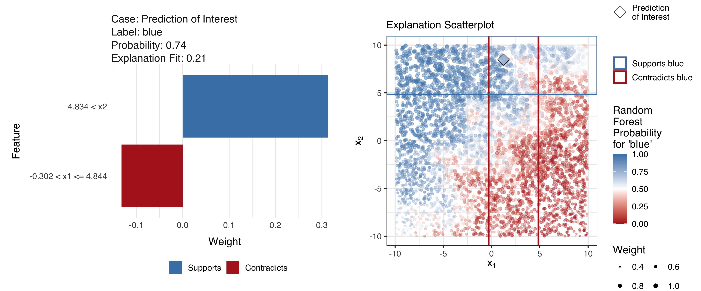

# LIME Diagnostics Paper



This repository contains the files associated with the paper “Visual
Diagnostics of a Model Explainer – Tools for the Assessment of LIME
Explanations” by Katherine Goode and Heike Hofmann. The rest of this
readme contains:

  - information about the files in the repository,
  - instructions for knitting the paper,
  - descriptions of the bullet data used in the paper,
  - information on the font sizes used for the figures in the
    manuscript, and
  - the steps taken to create the `submission` folder.

## Description of Items in Repository

**Folders**

  - `old-version` contains the files associated with an old version of
    the paper that is much longer the the submitted version.
  - `submission` contains all of the files submitted to the ASA data
    science journal. Note that the paper is specified slightly different
    in this folder in order to meet the requirements of the ASA data
    science journal. These are as follows:
      - The figure path in the .Rnw saves the generated figures in the
        main folder (instead of a figures folder).

**Files**

  - `code-file-organization.R` contains R code for organizing the files
    to be added to the GitHub repository and generating a file with code
    for submission.
  - `code-paper.R` contains the R code extracted from `paper.Rnw` using
    code in `code-file-organization.R`.
  - `data-bullet-test.csv.zip` and `data-bullet-test.csv.zip` contain
    the data used for the bullet examples in the paper. Additional
    information about these files is included below under the heading
    “Additional Information on Bullet Data”.
  - `data-example-signatures.csv.zip` contains signature data from two
    matching bullet lands that is used to generate a figure in the
    manuscript.
  - `figure-08-1.png.zip` is the one figure in the manuscript that is
    not generated using R code.
  - `figure-readme.png` is a figure used in the readme.
  - `.gitignore` contains objects to be ignored by git.
  - `paper.Rnw`, `paper.pdf`, and `paper.tex` are the manuscript. Note
    that `paper.pdf` and `paper.tex` are generated by `paper.Rnw`.
  - `README.Rmd` and `README.md` are the readme files that generated
    this output. :)
  - `references.bib` contains the bibtex information for the
  - `WileyNJG-AMS.bst` and `WileyNJG-v2.cls` contain the latex
    formatting specifications for the ASA data science journal.

## Instructions for Knitting Paper

When the paper is knit, various files will be generated (such as
`data-bullet-explain.rds` and `figure-10-1.png`). The first time the
paper is knit, it will take a while (approximately 45 minutes on
Katherine’s computer). Once these files have been generated during the
first knit, the paper will take much less time to knit (approximately 1
minute on Katherine’s computer).

Follow these instructions to knit the paper:

1.  Pull the repository from GitHub.
2.  Unzip all .zip files in the repository (`data-bullet-train.csv.zip`,
    `data-bullet-test.csv.zip`, `data-example-signatures.csv.zip`, and
    `figure-08-1.png.zip`).
3.  Install R packages goodekat/lime and goodekat/limeaid R from GitHub
    using devtools.

<!-- end list -->

``` r
devtools::install_github("goodekat/lime")
devtools::install_github("goodekat/limeaid")
```

4.  Knit paper (via the paper.Rnw file).

## Additional Information on Bullet Data

**Need to write…**

## Figure Font Size Information

The font sizes in the figures are calculated based on how the figures
are scaled due to the specification of both fig.width and out.width in
the Rnw file to ensure that they are consistent across figures. The text
sizes are either set to 7 pt or 5.5 pt as indicated by the table below.
Note that the text in the manuscript is 9 pt and a similar approach was
used to ensure that line sizes are larger than 0.5 pt.

| Part of Graphic                                          | Font Size |
| -------------------------------------------------------- | --------- |
| Title                                                    | 7 pt      |
| Subtitle                                                 | 7 pt      |
| Axis labels                                              | 7 pt      |
| Facet labels that act as x-axis or y-axis labels         | 7 pt      |
| Facet labels that act as titles for lime R package plots | 7 pt      |
| Legend titles                                            | 7 pt      |
| Interior labels (such as those created using geom\_text) | 7 pt      |
| Axis tick labels                                         | 5.5 pt    |
| Facet labels (general)                                   | 5.5 pt    |
| Legend labels                                            | 5.5 pt    |

## Steps Followed to Create the Submission Folder

Follow these steps to make sure all guidelines are met for submission.

1.  Knit paper (to make sure everything is up to date).
2.  Run the code in the file code-extract-paper-code.R to produce an R
    script with all of the code from the manuscript (paper.Rnw).
3.  **Need to finish…**
