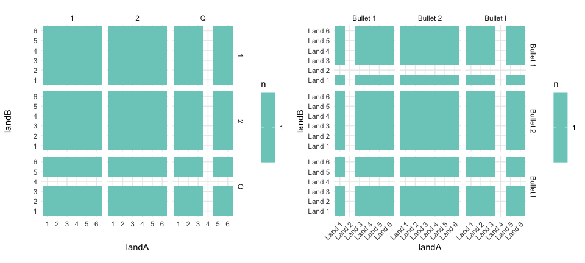
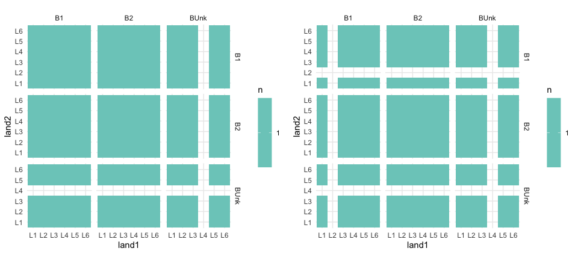
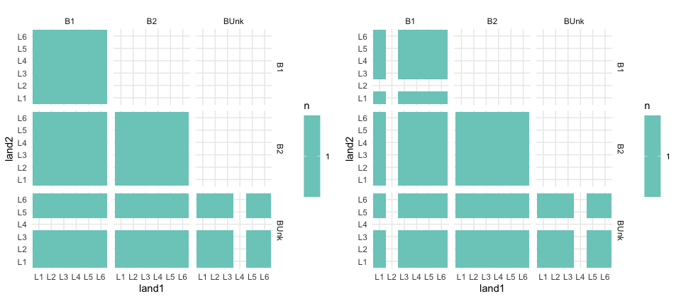

Bullet Data Preparation for LIME Diagnostics Paper
================
Katherine Goode
<br>January 07, 2021

This document contains code for preparing the raw bullet data sets
(training, testing, and example matching signatures) to be used the
paper “Visual Diagnostics of a Model Explainer – Tools for the
Assessment of LIME Explanations”.

**NOTE** The code chunks where the prepared data versions are shared
have `eval = FALSE`. These code chunks must be run manually. This is
done to help avoid any accidental changes of the data.

Load R packages:

``` r
library(cowplot)
library(dplyr)
library(forcats)
library(ggplot2)
library(randomForest)
library(readr)
library(stringr)
library(tidyr)
library(zip)
```

Obtain features used when fitting the rtrees random forest:

``` r
rtrees_features <- rownames(bulletxtrctr::rtrees$importance)
```

# Bullet Training Data

Load the training data provided by Heike (from CSAFE data base; see this
[R
script](https://github.com/erichare/imaging-paper/blob/master/code/full_run.R)
for the code used to access the data):

``` r
if (!file.exists("../data/raw/CCFs_withlands.csv")) {
  unzip("../data/raw/CCFs_withlands.csv.zip", exdir = "../data/raw")
}
bullet_train_raw = read.csv("../data/raw/CCFs_withlands.csv")
```

The raw data contains 83028 observations (comparisons of signatures) and
26 variables. The table below lists the levels of study, barrel, bullet,
and land contained within the raw data. One of the study labels is
`Hamby44`. CSAFE has determined that these bullets are actually from
study `Hamby173`. Additionally, note that the barrel labels contains
letters. These barrels are “unknown” barrels, and the new labeling
convention used by CSAFE is to use the label for barrel of `BrUnk` and
label the bullet using the letter (such as `BA`).

| Descriptor | Levels                                                                                          |
| ---------- | ----------------------------------------------------------------------------------------------- |
| Study      | Hamby252, Hamby44                                                                               |
| Barrel     | 10, 1, 2, 3, 4, 5, 6, 7, 8, 9, B, C, D, E, F, H, J, L, M, Q, S, U, X, Y, Z, A, G, I, N, R, V, W |
| Bullet     | 1, 2                                                                                            |
| Land       | 1, 2, 3, 4, 5, 6                                                                                |

The code below cleans and prepares the data for use in the paper. The
steps taken are as follows:

1.  Rename the label variables using numbers instead of letters
    (e.g. `study.x` and `study.y` become `study1` and `study2`,
    respectively), and rename `match` as `samesource`.
2.  Select only the variables of interest for the study: signature ID
    labels (`study1`, `barrel1`, `bullet1`, `land1`, `study2`,
    `barrel2`, `bullet2`, and `land2`), features used to train the
    `rtrees` random forest model (`ccf`, `rough_cor`, `D`, `sd_D`,
    `matches`, `mismatches`, `cms`, `non_cms`, and `sum_peaks`), and the
    variable identifying whether the two signatures are fired from the
    same gun (`samesource`).
3.  Convert all categorical variables to characters.
4.  Change the study labels to the correct studies and the barrel and
    bullet variable labels to the new CSAFE labeling conventions.
5.  Add letters to the barrel, bullet, and land labels to conform to the
    CSAFE labeling conventions.
6.  Create land ID variables that combine study, barrel, bullet, and
    land labels.
7.  Add a case variable (just numbering comparisons 1 through 83028
    based on current order in the data).
8.  Select final variables for data to use in paper: number assinged to
    signature (`case`), land IDs (`land_ID1`, `land_ID2`), features used
    to train the `rtrees` random forest model (`ccf`, `rough_cor`, `D`,
    `sd_D`, `matches`, `mismatches`, `cms`, `non_cms`, and `sum_peaks`),
    and the variable identifying whether the two signatures are fired
    from the same gun (`samesource`).

<!-- end list -->

``` r
# Identify the letters used to label barrels 
all_barrel_labels <- unique(c(bullet_train_raw$barrel.x, bullet_train_raw$barrel.y))
letters <- all_barrel_labels[!(all_barrel_labels %in% 1:10)]

bullet_train <- 
  bullet_train_raw %>%
  # 1. Rename variables
  rename(
    "study1" = "study.x", "barrel1" = "barrel.x", "bullet1" = "bullet.x", "land1" = "land.x",
    "study2" = "study.y", "barrel2" = "barrel.y", "bullet2" = "bullet.y", "land2" = "land.y",
    "samesource"= "match"
  ) %>%
  # 2. Select variables of interest
  select(
    study1, barrel1, bullet1, land1,
    study2, barrel2, bullet2, land2,
    all_of(rtrees_features), samesource
  ) %>%
  # 3. Convert categorical variables to characters
  mutate(across(c(barrel1, bullet1, land1, barrel2, bullet2, land2), as.character)) %>%
  # 4. Adjust study, barrel, and bullet labels
  mutate(
    study1 = ifelse(study1 == "Hamby44", "Hamby173", study1),
    study2 = ifelse(study2 == "Hamby44", "Hamby173", study2),
    bullet1 = ifelse(barrel1 %in% letters, barrel1, bullet1),
    bullet2 = ifelse(barrel2 %in% letters, barrel2, bullet2),
    barrel1 = ifelse(barrel1 %in% letters, "Unk", barrel1),
    barrel2 = ifelse(barrel2 %in% letters, "Unk", barrel2)
    ) %>%
  # 5. Add abbreviations in front of barrel, bullet, and land labels
  mutate(
    barrel1 = paste0("Br", barrel1),
    barrel2 = paste0("Br", barrel2),
    bullet1 = paste0("B", bullet1),
    bullet2 = paste0("B", bullet2),
    land1 = paste0("L", land1),
    land2 = paste0("L", land2)
  ) %>%
  # 6. Create land ID variables
  mutate(
    land_id1 = paste(study1, barrel1, bullet1, land1, sep = "-"),
    land_id2 = paste(study2, barrel2, bullet2, land2, sep = "-")
  ) %>%
  # 7. Add a case variable
  mutate(case = as.character(1:n())) %>%
  # 8. Select final variables
  select(case, land_id1, land_id2, all_of(rtrees_features), samesource)
```

Check to make sure the number of rows in the data is still the same:

``` r
dim(bullet_train)
```

    ## [1] 83028    13

The land IDs in the cleaned bullet training data are separated in the
code below, so that the updated signature identification labels can be
included in the table below:

``` r
bullet_train_expanded <- 
  bullet_train %>% 
  separate(col = land_id1, into = c("study1", "barrel1", "bullet1", "land1")) %>%
  separate(col = land_id2, into = c("study2", "barrel2", "bullet2", "land2"))
```

| Descriptor | Labels                                                                                         |
| ---------- | ---------------------------------------------------------------------------------------------- |
| Study      | Hamby252, Hamby173                                                                             |
| Barrel     | Br10, Br1, Br2, Br3, Br4, Br5, Br6, Br7, Br8, Br9, BrUnk                                       |
| Bullet     | B1, B2, BB, BC, BD, BE, BF, BH, BJ, BL, BM, BQ, BS, BU, BX, BY, BZ, BA, BG, BI, BN, BR, BV, BW |
| Land       | L1, L2, L3, L4, L5, L6                                                                         |

Determine the number of total study-barrel-bullet-lands in the data:

``` r
length(unique(c(bullet_train$land_id1, bullet_train$land_id2)))
```

    ## [1] 408

Save the prepared data as a csv file:

``` r
write.csv(
  x = bullet_train, 
  file = "../data/bullet-train.csv", 
  row.names = FALSE
)
```

Also, save the original and prepared data as a zip files (for uploading
to the GitHub repository):

``` r
zip(
  zipfile = "../data/bullet-train.csv.zip", 
  files = "../data/bullet-train.csv"
)
```

# Bullet Testing Data

Load in the raw Hamby 224 datasets (sets 1 and 11; provided by Heike and
CSAFE):

``` r
if (!file.exists("../data/raw/h224-set1-features.rds")) {
  unzip("../data/raw/h224-set1-features.rds.zip", exdir = "../data/raw")
}
if (!file.exists("../data/raw/h224-set11-features.rds")) {
  unzip("../data/raw/h224-set11-features.rds.zip", exdir = "../data/raw")
}
hamby224_set1 <- readRDS("../data/raw/h224-set1-features.rds")
hamby224_set11 <- readRDS("../data/raw/h224-set11-features.rds")
```

The bullet and land names from each of the sets are included below. This
indicates that each set contains 3 bullets with 6 lands each.

| Set | Bullets                      | Lands                                          |
| --- | ---------------------------- | ---------------------------------------------- |
| 1   | 1, 2, Q                      | 1, 2, 3, 4, 5, 6                               |
| 11  | Bullet 1, Bullet 2, Bullet I | Land 1, Land 3, Land 4, Land 5, Land 6, Land 2 |

The dimensions of the datasets are:

| Set | Number of Rows | Number of Columns |
| --- | -------------- | ----------------- |
| 1   | 289            | 29                |
| 11  | 256            | 29                |

The number of rows in each of these datasets indicates that there are
some lands missing since a complete set with 3 bullets and 6 lands would
contains 3 bullets x 3 bullets x 6 lands x 6 lands = 324 comparisons.
The figures below show that set 1 is missing land 4 from bullet Q, and
set 11 is missing land2 from bullet 1 and land 4 from bullet I.

``` r
plot_grid(
  hamby224_set1 %>%
    count(bulletA, bulletB, landA, landB) %>%
    ggplot(aes(
      x = landA, y = landB, fill = n
    )) +
    geom_tile() +
    facet_grid(bulletB ~ bulletA) +
    scale_fill_distiller(palette = "GnBu", direction = 1) +
    theme_minimal() +
    theme(aspect.ratio = 1),
  hamby224_set11 %>%
    count(bulletA, bulletB, landA, landB) %>%
    ggplot(aes(
      x = landA, y = landB, fill = n
    )) +
    geom_tile() +
    facet_grid(bulletB ~ bulletA) +
    scale_fill_distiller(palette = "GnBu", direction = 1) +
    theme_minimal() +
    theme(aspect.ratio = 1, 
          axis.text.x = element_text(angle = 45, hjust = 1)),
  align = "hv"
)
```



Preparing the data from sets 1 and 11 for analysis:

``` r
hamby224_set1_cleaned <-
  hamby224_set1 %>%
  # Remove unneeded variables
  select(-bullet_score,-land1,-land2,-aligned,-striae,-features) %>%
  # Rename bullet and land variables
  rename(
    bullet1 = bulletA,
    bullet2 = bulletB,
    land1 = landA,
    land2 = landB
  ) %>%
  # Create study and set variables and change levels of bullet and land
  # variables to match those in the training data
  mutate(
    study = factor("Hamby224"),
    set = factor("Set1"),
    bullet1 = recode(factor(bullet1), "1" = "B1", "2" = "B2", "Q" = "BUnk"),
    bullet2 = recode(factor(bullet2), "1" = "B1", "2" = "B2", "Q" = "BUnk"),
    land1 = paste0("L", land1),
    land2 = paste0("L", land2)
  ) %>%
  # Order the variables as desired
  select(study, set, bullet1, land1, bullet2, land2, all_of(rtrees_features), samesource)

hamby224_set11_cleaned <- 
  hamby224_set11 %>%
  # Remove unneeded variables
  select(-bullet_score,-land1,-land2,-aligned,-striae,-features) %>%
  # Rename bullet and land variables
  rename(
    bullet1 = bulletA,
    bullet2 = bulletB,
    land1 = landA,
    land2 = landB
  ) %>%
  # Create study and set variables and change levels of bullet and land
  # variables to match those in the training data
  mutate(
    study = factor("Hamby224"),
    set = factor("Set11"),
    bullet1 = recode(factor(bullet1), "Bullet 1" = "B1", "Bullet 2" = "B2", "Bullet I" = "BUnk"),
    bullet2 = recode(factor(bullet2), "Bullet 1" = "B1", "Bullet 2" = "B2", "Bullet I" = "BUnk"),
    land1 = str_remove(land1, "and "),
    land2 = str_remove(land2, "and ")
  ) %>%
  # Order the variables as desired
  select(study, set, bullet1, land1, bullet2, land2, all_of(rtrees_features), samesource)
```

Plots show that the number of observations is still the same after
cleaning:

``` r
plot_grid(
  hamby224_set1_cleaned %>%
    count(bullet1, bullet2, land1, land2) %>%
    ggplot(aes(
      x = land1, y = land2, fill = n
    )) +
    geom_tile() +
    facet_grid(bullet2 ~ bullet1) +
    scale_fill_distiller(palette = "GnBu", direction = 1) +
    theme_minimal() +
    theme(aspect.ratio = 1),
  hamby224_set11_cleaned %>%
    count(bullet1, bullet2, land1, land2) %>%
    ggplot(aes(
      x = land1, y = land2, fill = n
    )) +
    geom_tile() +
    facet_grid(bullet2 ~ bullet1) +
    scale_fill_distiller(palette = "GnBu", direction = 1) +
    theme_minimal() +
    theme(aspect.ratio = 1),
  align = "hv"
)
```



Join the two cleaned Hamby 224 sets into one testing set, remove
duplicate comparisons, create a case variable, and create land ids based
on the study, set, bullet, and land (remove those variables afterwards):

``` r
bullet_test_extra_vars <-
  # Join the two data sets
  bind_rows(hamby224_set1_cleaned, hamby224_set11_cleaned) %>%
  # Remove duplicate comparisons
  filter(!(bullet1 == "BUnk" & bullet2 == "B1"),
         !(bullet1 == "BUnk" & bullet2 == "B2"),
         !(bullet1 == "B2" & bullet2 == "B1")) %>%
  # Create a case and land_id variables
  mutate(
    case = factor(1:length(study)),
    land_id1 = paste(study, set, bullet1, land1, sep = "-"),
    land_id2 = paste(study, set, bullet2, land2, sep = "-")
  ) # Leave the extra variables for plotting

# Select and order variables to keep for analysis
bullet_test <- bullet_test_extra_vars %>%
  select(case, land_id1, land_id2, all_of(rtrees_features), samesource)
```

Remaining comparisons included in the test data after the duplicate
comparisons are removed:

``` r
plot_grid(
  bullet_test_extra_vars %>%
    filter(set == "Set1") %>%
    count(bullet1, land1, bullet2, land2) %>%
    ggplot(aes(
      x = land1, y = land2, fill = n
    )) +
    geom_tile() +
    facet_grid(bullet2 ~ bullet1) +
    scale_fill_distiller(palette = "GnBu", direction = 1) +
    theme_minimal() +
    theme(aspect.ratio = 1),
  bullet_test_extra_vars %>%
    filter(set == "Set11") %>%
    count(bullet1, land1, bullet2, land2) %>%
    ggplot(aes(
      x = land1, y = land2, fill = n
    )) +
    geom_tile() +
    facet_grid(bullet2 ~ bullet1) +
    scale_fill_distiller(palette = "GnBu", direction = 1) +
    theme_minimal() +
    theme(aspect.ratio = 1),
  align = "hv"
)
```



Save the test data as a csv file:

``` r
write.csv(
  x = bullet_test, 
  file = "../data/bullet-test.csv", 
  row.names = FALSE
)
```

Also, save the original and prepared data as a zip files (for uploading
to the GitHub repository):

``` r
zip(
  zipfile = "../data/bullet-test.csv.zip", 
  files = "../data/bullet-test.csv"
)
```

# Example Matching Signatures

The following code trims the data provided by Heike of two matching
bullet-land signatures.

Import the data (provided by Heike and CSAFE):

``` r
if (!file.exists("../data/raw/signatures.rds")) unzip("../data/raw/signatures.rds.zip", exdir = "../data/raw")
signatures <- readRDS("../data/raw/signatures.rds")
```

Structure of the data:

``` r
signatures %>% str()
```

    ## tibble [2,244 × 7] (S3: tbl_df/tbl/data.frame)
    ##  $ source : chr [1:2244] "README_files/data/Bullet1/Hamby252_Barrel1_Bullet1_Land3.x3p" "README_files/data/Bullet1/Hamby252_Barrel1_Bullet1_Land3.x3p" "README_files/data/Bullet1/Hamby252_Barrel1_Bullet1_Land3.x3p" "README_files/data/Bullet1/Hamby252_Barrel1_Bullet1_Land3.x3p" ...
    ##  $ x      : num [1:2244] 333 334 336 338 339 ...
    ##  $ y      : num [1:2244] 75 75 75 75 75 75 75 75 75 75 ...
    ##  $ value  : num [1:2244] 102 102 103 102 102 ...
    ##  $ raw_sig: num [1:2244] -2.17 -2 -1.85 -2.37 -2.86 ...
    ##  $ se     : num [1:2244] 0.184 0.183 0.182 0.181 0.18 ...
    ##  $ sig    : num [1:2244] -2.41 -2.3 -2.2 -2.11 -2.02 ...

Create a land variable based on the source variable, select only
variables necessary for the manuscript, and rename sig as y:

``` r
signatures_trimmed <-
  signatures %>%
  mutate(land = c("Signature 1", "Signature 2")[as.factor(source)]) %>%
  select(land, x, sig) %>%
  rename(y = sig)
```

Export the trimmed data as a csv file:

``` r
write.csv(
  x = signatures_trimmed,
  file = "../data/example-signatures.csv",
  row.names = FALSE
)
```

Also, save the original and prepared data as a zip files (for uploading
to the GitHub repository):

``` r
zip(
  zipfile = "../data/example-signatures.csv.zip", 
  files = "../data/example-signatures.csv"
)
```
